# General warnings:

> # ⚠️ Fan Project ⚠️
> I'm an inexperienced Programmer / Game master and a forever Fallout fan.
> This is a fan project made:
> - Mainly for my group
> - By a non-native english speaker
> - To learn stuff: there may be bugs, shitty code, etc.
> - By only me, in my free time, so updates may be frequent or stop altogether.

> # ⚠️ **WORK IN PROGRESS** ⚠️
>
> - This project is currently under active development. Many features are incomplete, and you may encounter bugs.  
> 
> 
> - **I highly encourage you to double check calculations and data, and report anything funky (open an issue here on Github).**
>
> 
> - The project has not been tested on all devices or screen sizes. It is primarily designed for mobile devices and tested on a screen size of approximately **412x915px** (though generally any "normal" mobile device should be ok and desktop "should" work, but it still has some funky layouts).

# Pip-Boy 3000 - PWA Companion App

A responsive, installable Progressive Web App (PWA) designed as a companion for the Fallout-themed tabletop RPG. This app allows players to manage their character's stats, skills, inventory, and perform dice rolls directly from their browser or installed on their device.

The interface is heavily inspired by the iconic Pip-Boy 3000 from the Fallout series, featuring FO3, FNV and other themes to match your favorite game.

#### Languages 🇺🇸🇮🇹
Available languages are English and Italian (you can change it in Settings ⚙️)

---

## 📲 Install as an App (an run it offline)

If you want to have a more native feel and **run the app while offline**, you can install this as an App (PWA).

* **On Mobile (Android/iOS):** Use your browser's menu and select "Add to Home Screen" or "Install App" to get a native-like app experience.
* **On Desktop (⚠Poorly supported⚠):** An "Install" icon will appear in the address bar. Click it to add the app to your desktop.

---

# What is NOT present...
## ...and will be implemented soon
### 90% of Perk actual effects
All Core Rulebook perks are in the app, but most of the effects are not automatically applied.  
I'll slowly implement them all. If you need a particular one implemented open an issue here on Github.
### DLC Perks
All DLC Perks are missing. I will probably start adding them once I'm done with Core Rulebook perks.
### Most of DLC-Origins
You will probably see all origins (even DLC ones) as selectable. However, most of DLC origins are currently badly implemented.  
Tribal and NCR are exceptions and can be used (though not all traits may have proper implementation).
### 60% of traits (mostly DLC ones)
Core Rulebook traits should be fine, but DLC traits are mostly not properly implemented.
### Aid items consumption
Currently, aid items cannot be consumed just "clicking a button".  
This will be implemented soon, but first I need to figure out how to handle effect duration.
### Power Armor
I still need to create the file with all Power Armor data and code the rules.
### Magazines
I still need to create the file with all the Magazines data and code the rules.

## ... and will not be implemented anytime soon
### A "Party" system  
The app currently runs locally on the device and does not have any way to connect to other Players or a Game Master.  
I may add this feature in the future, but not anytime soon.
### Action Points tracking
Since Action Points are cumulative to the party, AP tracking is not implemented in this project.  
The app, however, **will show when AP points are used**.
### "Scene" mechanics
Currently, there is no way to track when a Scene starts or ends.  
Any effect that happens "the first time that X happens during a scene" or "once per scene" or anything along those lines,
the user has to manually factor in the effect (sorry about this).  

An exception to this rule is when the activation of the effect is already "manual".  
For example the Trait "Rite of Passage" has a button next to it that rolls 1d6 to regain luck. It is up to the user to 
use that trait (click the button) once per scene when luck was used.

## ✨ Features

* **Character Stat Management:**
    * Track S.P.E.C.I.A.L. attributes with reactive updates.
    * Automatically calculates derived stats like Defense, Initiative, and Melee Damage.
    * View and manage all character skills (including specialties).
    * Persistent character data saved to localStorage.
    * NO TRAITS AND ABILITIES INTEGRATION YET
* **Comprehensive Inventory System:**
    * Organize items into categories: Weapons, Armor, Supplies, and Ammo.
    * Interactive accordion-style inventory with expandable cards.
    * Long-press to sell/delete items with confirmation dialogs.
    * Smart equipment system with layer conflict detection.
    * Weapons and mods are moddable
* **Integrated Dice Roller:**
    * **d20 Skill Checks:** Dedicated popup for skill checks with automatic target number calculation.
    * **d6 Damage Rolls:** Weapon damage rolls with support for extra hits and damage effects.
    * Luck point system for rerolls and bonuses.
* **Interactive Map:**  
    Zoomable and pannable world map, with the ability to unlock markers given a code (codes list provided below).  
    This project currently features ONLY the New Vegas Map (other maps may be added in the future).
* **Settings:**
    * **Language**  
      App can be set to either English or Italian
    * **Theming**   
    The app features several themes
      - Fallout 3 (green)
      - New Vegas (amber)
      - Old World Blues (blue)
      - Dead Money (red)
      - The Institute (white)
      - The Kings (purple)
    * **Character Management**  
      - Up to 10 different characters.
      - Import/Export characters as JSON files.

---

### 📍 Map Unlock Codes

Players can unlock markers on the New Vegas map by entering specific codes found in the wasteland (or right here).

Click to reveal New Vegas Map Codes

| Location | Code | Location | Code |
| :--- | :--- | :--- | :--- |
| Goodsprings | `g00d` | HELIOS One | `h3l1` |
| Goodsprings Cemetery | `gc3m` | Camp Golf | `c4g0` |
| Primm | `pr1m` | Camp Forlorn Hope | `c4fh` |
| Mojave Outpost | `m00t` | Vault 22 | `vt22` |
| Nipton | `n1pt` | Vault 3 | `vt03` |
| Novac | `nv4c` | Vault 34 | `vt34` |
| NCRCF | `ncrc` | Vault 11 | `vt11` |
| New Vegas Strip | `nvg5` | Vault 19 | `vt19` |
| Hoover Dam | `h00v` | Vault 21 | `vt21` |
| Jacobstown | `j4ck` | North Vegas Square | `nv3s` |
| Red Rock Canyon | `rrck` | The Thorn | `t3th` |
| Black Mountain | `bm0t` | Legate's Camp | `l3g4` |
| Hidden Valley | `h1v4` | REPCONN Test Site | `r3tt` |
| Camp McCarran | `cmcc` | REPCONN Headquarters | `r3h3` |
| Boulder City | `b0ul` | Follower's Outpost | `f040` |
| Cottonwood Cove | `c0tt` | Crimson Caravan Company | `cc4c` |
| The Fort | `th4t` | Old Mormon Fort | `0mm4` |
| Bitter Springs | `b15p` | King's School of Impersonation | `ks01` |
| Nelson | `n3l5` | Freeside East Gate | `fr3g` |
| Sloan | `sl4n` | Freeside North Gate | `frng` |
| Camp Searchlight | `cmsl` | Westside West Entrance | `w3w3` |
| Nellis Air Force Base | `n4fb` | Westside South Entrance | `w3s3` |
| Quarry Junction | `quju` | | |

---

## 📸 Screenshots
| **Boot Screen** | **Stats - SPECIAL** | **Stats - Skills** |
|:---:|:---:|:---:|
| 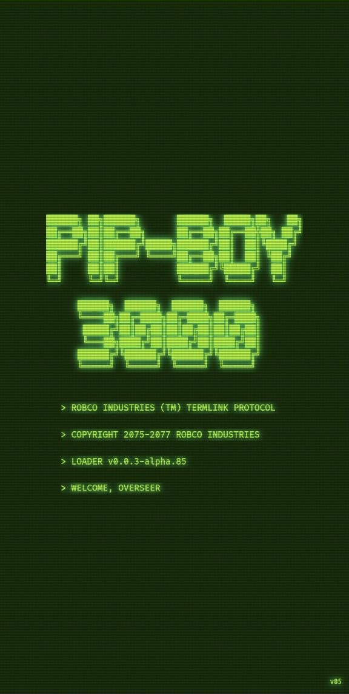 | 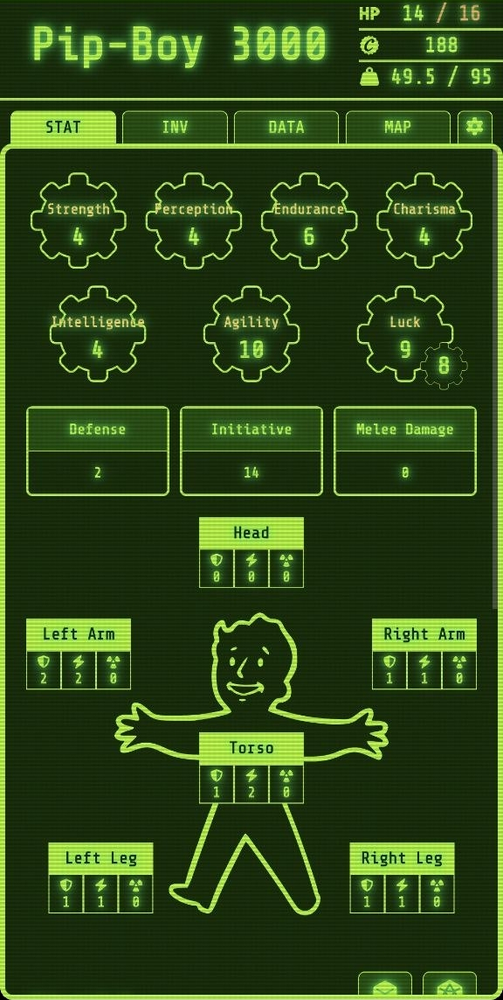 | 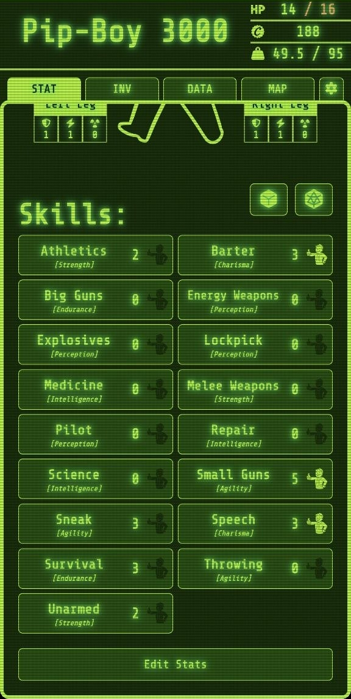 |
| **INV - Weapons** | **INV - Apparel** | **Data - Character** |
| 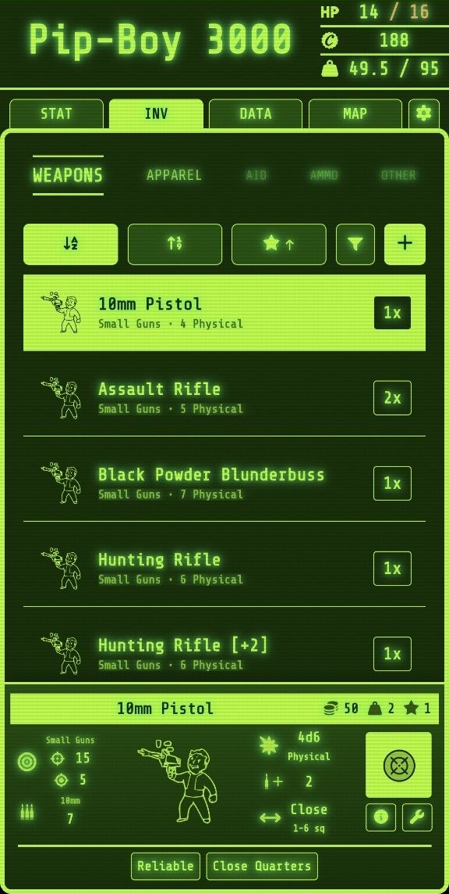 | 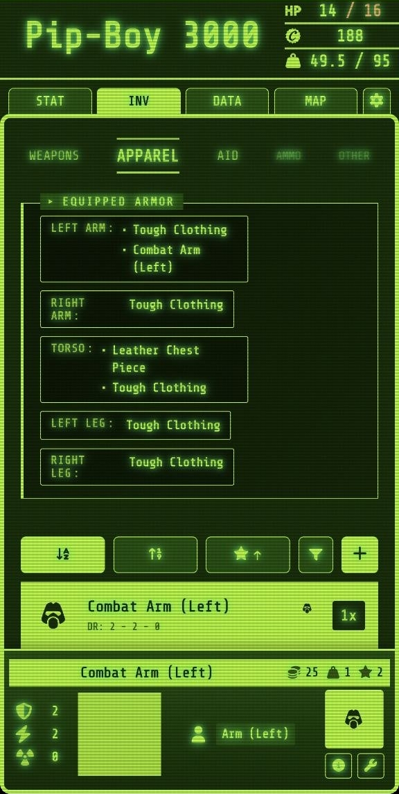 | 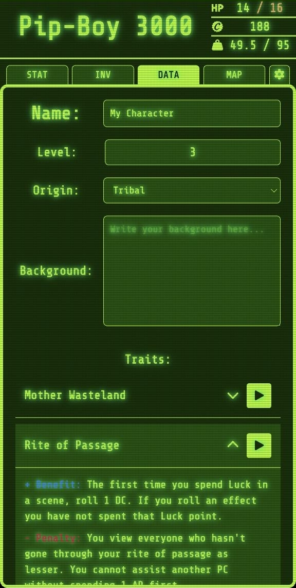 |
| **Data - Perks** | **Map Tab** | **Settings** |
| 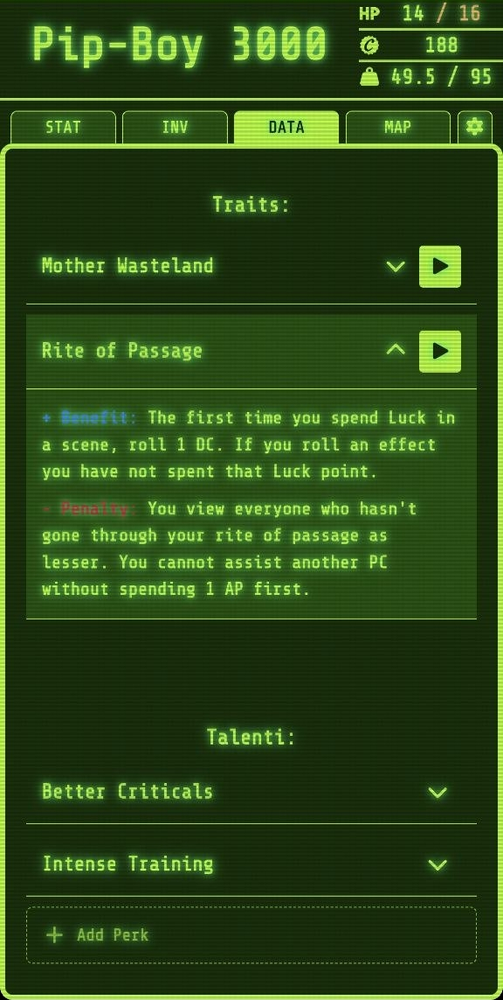 | 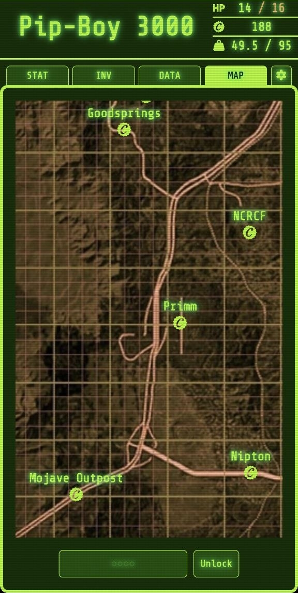 | 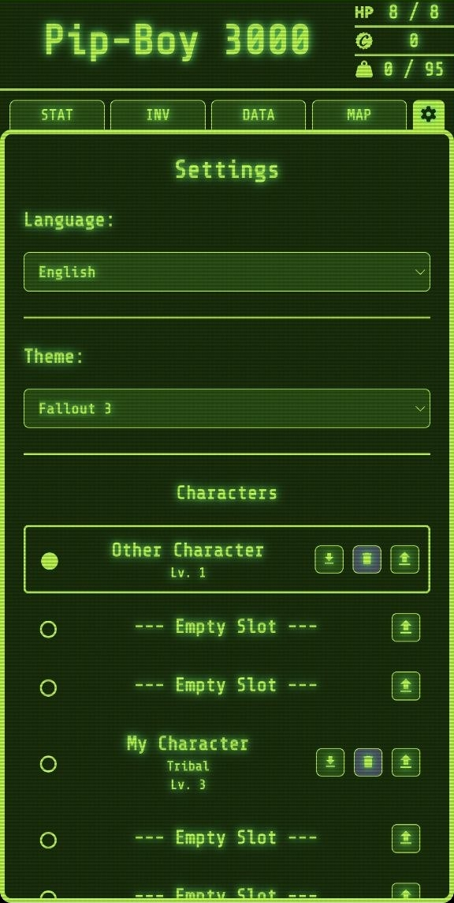 |
| **New Vegas Theme** | **Old World Blues Theme** | |
| 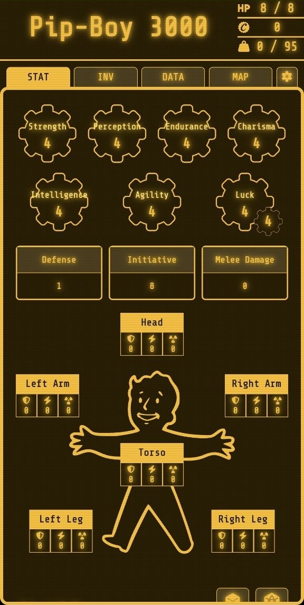 | 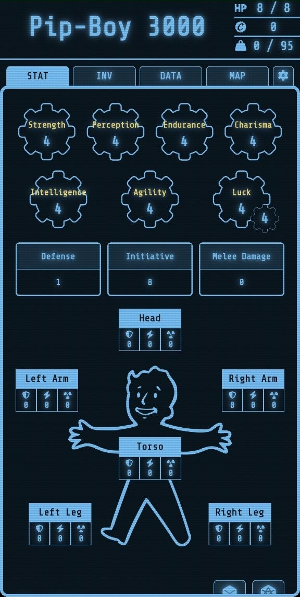 | |
---

## 📝 Usage

* **Navigate Tabs:** Use the main tabs (STAT, INV, DATA, MAP) to switch between screens.
* **Change Themes/Language:** Go to the Settings tab (the gear icon) to customize your experience.
* **Add Items:** In the INV tab, click the `+` button next to a category header to open a modal and add items to your inventory.
* **Perform a Skill Check:** On the STAT screen, click on a skill to open the d20 dice roller.
* **Roll for Damage:** In your inventory, click the crosshair icon on a weapon card to open the d6 damage roller.

---

## Fixes on Manual Rules
- weaponArcWelder uses ammoFusionCell, as ammoElectronChargePack is nowhere to be found on manuals.  
- NOT FINAL: Musket has damage 4 and fire rate 1 (instead of 5 and 0). This works as the special rule, 
but mods can bring fire rate to 0 (and this should not happen, I need to find a better solution)

## 🛠️ Development

### Want to report a bug?
Open an issue here on Github.

### Want to help in translating an unsupported language?
Translations are located in en.json and it.json

If you want me to implement a new language, make a pull request with a <your_language>.json file. 
Try to cover at least all non-'*Description' values.

Fallback language for missing translations in the selected language is English.

### Want to help in development?

Click to reveal

Do what you want, make your pull request, and good luck lol

### 🏗️ How it's built

**Tech stack**: React 19, TypeScript, Vite, i18next, PapaParse
**CSV Data**: Game content loaded dynamically with PapaParse

### 📊 Data format

Game data is in CSV files for easy editing:
- `public/data/weapon/` - Weapons with damage, range, ammo type
- `public/data/apparel/` - Armor with DR values and protection areas
- `public/data/aid/` - Consumables with effects

### 📈 Versioning

Uses semantic versioning: `0.0.3-alpha.BUILD_VERSION`
- `0.0.x` = Alpha milestone (patch = milestone number)
- `0.x.0` = Beta phase
- `x.0.0` = Stable release
- `BUILD_VERSION` gets updated on by GitHub Actions based on the deploy count

### 🤝 Contributing

Just follow the existing code style. Run `npm run quality` to check everything is good.

See [TODO.md](TODO.md) for what needs to be done.

---

### ⚖️ Disclaimer

*This is an unofficial fan project. Fallout and the Pip-Boy are trademarks of Bethesda Softworks/ZeniMax Media. Vault-Tec and the developer are not responsible for any radiation sickness, sudden limb loss, or accidental death resulting from the use of this unofficial firmware. Use at your own risk, Wastelander.*

---
